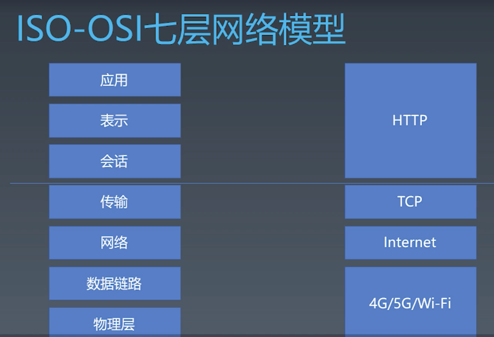

学习笔记

# 浏览器工作原理

### 总论


浏览器渲染流程

1.用户访问 url，通过 http 请求 html

2.对 html 文本进行 parse

3.把标签变成 DOM

4.进行 CSS computing
寻找 HTML 对应的 CSS 规则，可能有叠加，覆盖等 ，计算最后的 CSS 规则结果
得到一颗带 CSS 属性的 DOM 树

5.layout（排版或者布局）
可以得到 DOM 的大小和位置信息

6.render
渲染，绘制图片，添加颜色

7.最后得到 Bitmap

### 有限状态机

1. 每一个状态都是机器
   在机器中，可以做输入，存储，输出等等
   每个机器是互相解耦的，独立的
   机器本身是无状态的，例如纯函数，不会有副作用 -- 可以输入，但不能改变输入
   只需要关心本机器的状态

2. 每一个机器知道下一个状态
   分为 2 类

- 有确定的下一个状态 （Moore） 比如 a-b-c
- 根据输入决定下一个状态 （Mealy）通常根据具体场景决定返回下一个状态

```js
// 举例Mealy
// 每个函数是一个状态
function state(input) {
  // 参数就是输入
  //  函数中，可以自由编写代码，处理每个状态的逻辑
  return next // 返回值作为下一个状态
}

/// 下面是调用
while (input) {
  // 获取输入
  state = state(input) // 把状态机的返回值作为下一个状态
}
```

### HTTP 协议解析

图解计算机网络


#### TCP 与 IP 基础知识

- 流
- 端口
- 包
- IP 地址

#### HTTP 协议的 request

```
# request包含3部分，method 路径 协议版本
POST / HTTP/1.1

# Headers 是多行，每行用;分隔，类似k/v结构，以空白行结束
Host:127.0.0.1
Content-Type:application/x-www-form-urlencoded

# body 格式由Content-Type决定的
a=b&code=x%3D1
```

#### HTTP 协议的 response

```
# status line
HTTP/1.1 200 OK

# headers 同request
Content-Type:text/html
Date:Mon,23 Dec 2019 06:49:19 GMT
Connection:keep-alive
Transfer-Encoding:chunked


# body
26
<html><body>Hello World</body></html>
0
```
