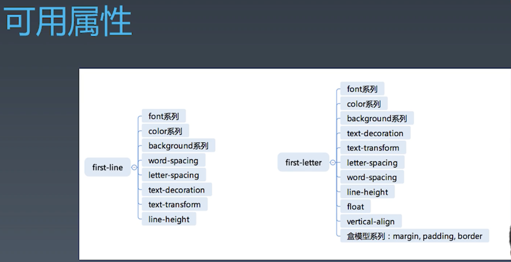

学习笔记

## CSS 总论

### 1. CSS 语法研究

css 总体结构为

- @charset
- @import
- rules
  - @media
  - @page
  - rule 最常用的

### 2. @规则研究

@rules 包括

- @charset
- @import
- @media \*(使用多)
- page
- counter-style
- keyframes \*
- fontface \*
- support
- namespace

### 3. CSS 规则的结构

- CSS 规则由 选择器 和 声明 组成
- 声明是 kv 结构，如`background:blue;`

选择器

- 复合选择器
- 简单选择器

CSS 小技巧
var 函数使用，如

```css
/*在根或父元素上声明一个变量(--后面跟一个变量名）*/
:root {
  --main-color: red;
}
/*然后在后代元素中使用 */
.child {
  color: var(--main-color);
}
```

### 4. 选择器语法

#### 4.1 简单选择器

- -
- 元素选择器
- .class
- #id
- [attr=value]
- :hover
- ::before ::after

#### 4.2 复合选择器

- <简单选择器> <简单选择器> <简单选择器>
- \*或 div 写在最前面

#### 4.3 复杂选择器

中间用分隔符连接

- <复合选择器> + <复合选择器>
- <复合选择器> > <复合选择器>
- <复合选择器> ~ <复合选择器>
- <复合选择器> || <复合选择器> table 的列

### 5. 伪类

#### 链接

- :any-link 未访问过的链接
- :link:visited 访问过的链接
- :hover
- :active
- :focus
- :target

#### 树结构

- :empty
- :nth-child()
- :nth-last-child()
- :first-child:last-child:only-child

#### 逻辑型

- :not
- :where:has

### 6. 伪元素

- ::before 需要设置 content
- ::after
- ::first-line 第一行
- ::first-letter 首字母


