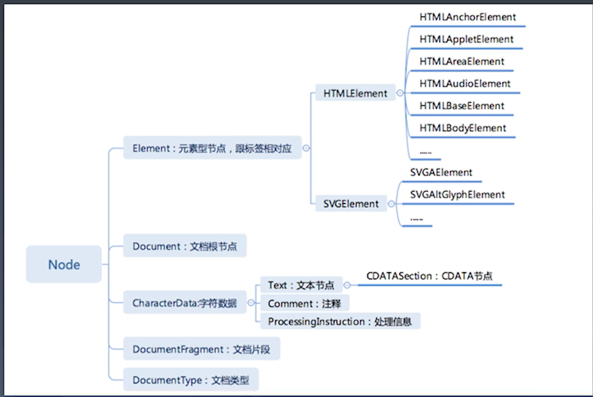

学习笔记

# 重学 HTML

HTML 源于 XML 和 SGML(数据描述系统)，是他们的子集

### 实体字符

1. 不建议使用$nbsp;来代替空格，而是使用 CSS 中的 white-space:pre;或者使用<pre>标签来处理空白
2. 其他常用实体符号

```html
$quot; 含义为" $amp; 含义为& $gt; > $lt; <
```

### 语义化标签

#### 常用的语义标签

- header
- main 一般表示页面主体，只有一个
- nav
- article
- aside
- h1,h2,strong
- ol,li
- pre,code
- footer

#### 语义化的意义：

- 便于 SEO
- 代码更有意义，便于理解和维护

### 浏览器 API | DOM API



#### 导航类操作

node 类

- parentNode
- childNodes
- firstChild
- lastChild
- nextSibling
- previousSibling

  标签元素类

- parentElement
- children
- firstElementChild
- lastElementChild
- nextElementSibling
- previousElementSibling

#### 修改操作

- appendChild
- insertBefore
- removeChild
- replaceChild

#### 高级操作

- compareDocumentPosition 是一个用于比较两个节点中关系的函数
- contains 检查一个节点是否包含另一个节点的函数
- isEqualNode 检查两个节点是否完全相同
- isSameNode 检查两个节点是否是同一个节点，实际上在 JavaScript 中可以用"==="
- cloneNode 复制一个节点，如果传入参数 true，则会连同子元素做深拷贝

### 事件 API

addEventListener

#### 冒泡和捕获

事件是先捕获，再冒泡

因为浏览器是先触发外层的事件，再根据事件的触发点一层层，计算到的

```html
<div>
  <span></span>
</div>
```

这段代码中，先捕获，顺序是 div>span
再冒泡，顺序是 span>div
