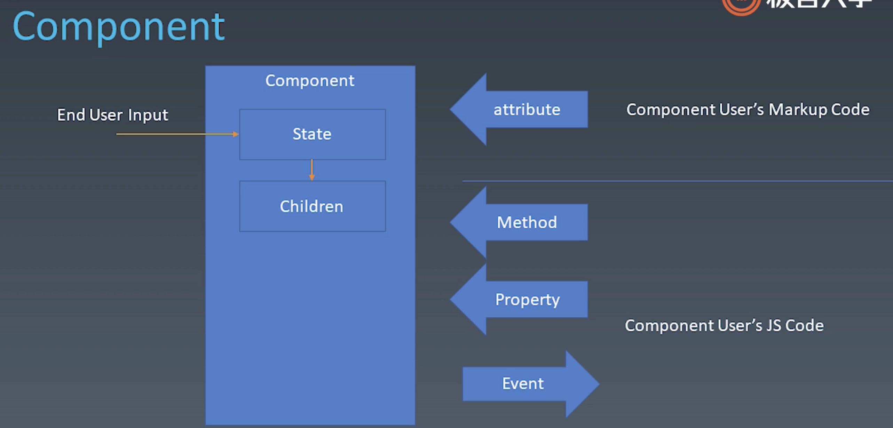

学习笔记

# 组件化

组件化是 HTML 的扩展，目的就是提高复用性

### 组件基础

#### 对象和组件

1. 对象

- Properties
- Methods
- Inherit

2. 组件
   组件通常含有 UI，所以有多出的属性

- Properties
- Methods
- Inherit
- Attribute
- Config & State 组件的配置和状态
- Event 组件会传递事件
- Lifecycle 组件拥有自己的生命周期
- Children 树形结构

#### Attribute vs Property

Attribute 通常指标签上的属性
Property 通常指对象上的属性，或者组件中传入的属性

#### 如何设计组件状态

config
一般是初始配置，一次性传入，不支持后续改动

state
是指组件内部的状态，跟组件的交互和数据相关
一般由用户操作改变，开发者不能改变

#### 组件生命周期

- created
- mount/unmount
- update
- destroyed

#### children

content 型
组件由子组件组成，子组件啥样就是啥样

template 型
子组件是动态的，比如列表，传入 listData，就渲染出一个列表组件
