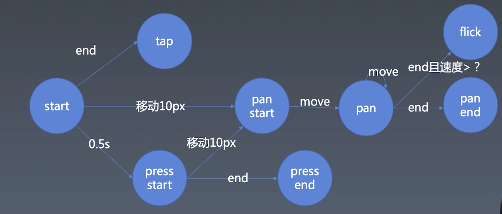

学习笔记
动画部分见 week14

### 手势基础知识

桌面端的移动和手机端的移动是两类事件

mousedown,
mousemove,
mouseup

touchstart,
touchmove,
touchcancel

### 封装 9 类事件或手势

- start 轻触
- tapEnd
- press 按压
- pressEnd
- panStart
- pan 移动
- panEnd
- flick 快速滑动
- cancel

### 运行项目

1. cd gesture
2. npm i http-server -g
3. http-server
